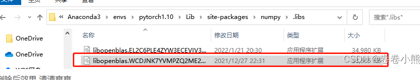

# JITTOR 限制内存的方法
     export JT_SAVE_MEM=1
     --限制cpu最多使用16G
     export cpu_mem_limit=16000000000
     --限制device内存（如gpu、tpu等）最多使用8G
     export device_mem_limit=8000000000
     windows 用户，请使用powershell
     $env:JT_SAVE_MEM="1"
     $env:cpu_mem_limit="16000000000"
     $env:device_mem_limit="8000000000"

https://huggingface.co/THUDM/chatglm-6b-int4

conda activate JITTOR

$env:JT_SAVE_MEM="1"
$env:cpu_mem_limit="16000000000"
$env:device_mem_limit="8000000000"

## problem_1 
1. UserWarning: loaded more than 1 DLL from .libs:
   https://blog.csdn.net/weixin_43113412/article/details/122628921

## 代码
1. https://huggingface.co/THUDM/chatglm-6b-int4
   